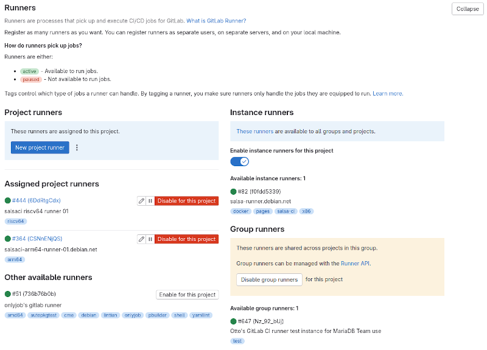
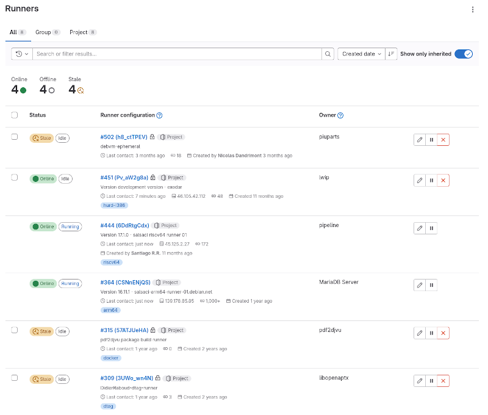

# GitLab CI runners for Salsa

This document explains how to setup and maintain your own GitLab CI runners.

If you want to learn about the existing shared runners on salsa.debian.org or
donate hardware of computing resources to Debian, see the [general Salsa
FAq](https://wiki.debian.org/Salsa/FAQ#Donating_runners).

## Types of runners

In GitLab, there are [three
types](https://salsa.debian.org/help/ci/runners/runners_scope) of CI runners:

* *Instance runners* are available for the entire GitLab instance. In the case
  of salsa.debian.org, there is a shared instance runner pool called
  `salsa-runner.debian.net`. Instance runners can only be created by the [Salsa
  administrators](https://wiki.debian.org/Salsa), not to be confused with the
  [Salsa CI Team](https://wiki.debian.org/Teams/SalsaCI).

* *Group runners* are available in a particular group only and can only be
  created by group Owner. These are rarely used, and for example the [group
  "Debian" has no group
  runners](https://salsa.debian.org/groups/debian/-/runners?runner_type[]=GROUP_TYPE).

* *Project runners* can be explicitly activated in one or more projects. A
  project may opt out from using instance and group runners, but uses them by
  default. Project runners are not used by default, but need to be enabled
  per-project. To register a new project runner, one needs to have a least the
  Maintainer role in a project.

Screenshot below shows the page
https://salsa.debian.org/mariadb-team/galera-4/-/settings/ci_cd as viewed by
the Owner, with full access to create a _New project runner_, to _Enable_ and
_Disable_ existing project runners, and to Enable/Disable both Instance runners
and Group runners.



Runners can also be viewed on the Group level, as illustrated in screenshot
below from https://salsa.debian.org/groups/debian/-/runners:




## Registering new runners

Creating a new runner is initiated from a GitLab project, where one defines the
basic settings of the runner, such as name and what job tags it is intended for
(if any). The creation process yields a _runner authentication token_, which
then needs to be passed to a GitLab Runner program to register it.


## Installing the GitLab Runner

The GitLab Runner is not available in Debian yet, and thus must be installed
from [GitLab's repositories](https://docs.gitlab.com/runner/install/linux-repository.html).
In addition to the GitLab Runner to orchestrate fetching and executing the CI
jobs, additional software is also needed according to the selected executor
type. While there have been prototypes for
[KVM/libvirt](https://docs.gitlab.com/runner/executors/custom_examples/libvirt.html),
[LXD and systemd-nspawn](https://gitlab.com/gitlab-org/gitlab-runner/-/issues/1585),
the most practical choice for executor type remains to be "Docker", for which
Podman can be used.

On a Debian 12 (Bookworm) host, the following commands will install the minimal
set of required software and start the registration:

```shell
curl -L https://packages.gitlab.com/gpg.key | \
  sudo gpg --dearmor --yes --output /usr/share/keyrings/runner_gitlab-runner-archive-keyring.gpg
echo "deb [signed-by=/usr/share/keyrings/runner_gitlab-runner-archive-keyring.gpg] \
  https://packages.gitlab.com/runner/gitlab-runner/debian/ bookworm main" | \
  sudo tee /etc/apt/sources.list.d/runner_gitlab-runner.list
sudo apt-get update
sudo apt-get install --yes gitlab-runner podman-docker
sudo gitlab-runner register  --url https://salsa.debian.org  --token <token>
```

Once registration is complete, both the relevant salsa.debian.org settings page
should show the runner active, and `sudo gitlab-runner verify` should complete
stating the runner is valid.


## Configuring the runner

For optimal operation, the runner might need some additional configuring.

The following is an example of `/etc/gitlab-runner/config.toml` contents:

```toml
concurrent = 6
check_interval = 0
connection_max_age = "15m0s"
shutdown_timeout = 0

[session_server]
  session_timeout = 1800

[[runners]]
  name = "<hostname>"
  url = "https://salsa.debian.org"
  id = 646
  token = "glrt-<secret>"
  token_obtained_at = 2024-09-05T05:54:44Z
  token_expires_at = 0001-01-01T00:00:00Z
  executor = "docker"
  # Needed for LXD-in-Docker and Docker-in-Docker to have network access
  environment = ["FF_NETWORK_PER_BUILD=1"]
  [runners.custom_build_dir]
  [runners.cache]
    MaxUploadedArchiveSize = 0
    [runners.cache.s3]
    [runners.cache.gcs]
    [runners.cache.azure]
  [runners.docker]
    tls_verify = false
    image = "debian:sid-slim"
    # Needed for LXD-in-Docker and Docker-in-Docker to be allowed to run
    privileged = true
    disable_entrypoint_overwrite = false
    oom_kill_disable = false
    disable_cache = false
    # Assuming a large filesystem mounted at /srv/podman
    cache_dir = "/srv/podman/gitlab-runner-cache"
    volumes = [
      "/cache",
      "/certs/client",
    ]
    shm_size = 0
    network_mtu = 0
```

Each runner needs to adapt the configuration to suit each installation.

For reference, see also the [configuration of Salsa provided
runners](https://salsa.debian.org/salsa/salsa-ansible/-/tree/master/roles/gitlab-runner/.)

To restart the runner and see the systemd logs run:

```shell
sudo systemctl restart gitlab-runner.service
sudo journalctl --follow -u gitlab-runner
```

Alternatively, just run `sudo pkill -SIGHUP -f gitlab-runner` to make the runner
reload the configuration.


### Large and efficient storage

For the runner to be efficient, it should use local cache and have plenty of
disk space (500GB +). Assuming a large volume was mounted at `/srv/podman`,
Podman can be instructed to use it for the disk images by creating a
`/etc/containers/storage.conf` with the contents:

```toml
[storage]
  driver = "overlay"
  runroot = "/srv/podman/runroot"
  graphroot = "/srv/podman/graphroot"
```

### Docker registry API throttling

Most of the Salsa CI (and GitLab CI in general) relies on using Docker images.
To ensure the runner does not get throttled by the Docker registry API, create
an account at Docker.io, and register the runner with `sudo podman login docker.io`.


### Runner hardware

If possible, get physical hardware to avoid too many layers of virtualisation.
As the main Salsa instance is hosted in Vancouver, Canada, the runner will be
slightly faster in downloading git repositories if it is hosted in northwest USA
or southwest Canada (e.g. states of British Columbia, Washington or Oregon).

The runner host will constantly be downloading, unpacking compressed files and
compiling source code. This type of workload is in particular IO and CPU heavy.
Choose large and fast NVMe SSD disks, and has much CPU as possible. A rule of
thumb the amount of memory is 2 GB of RAM for each CPU core.
