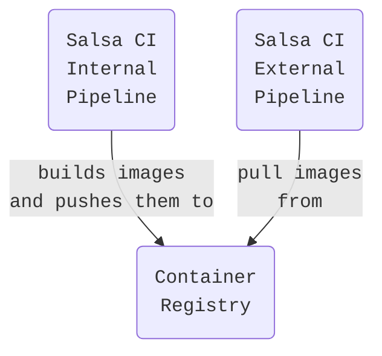
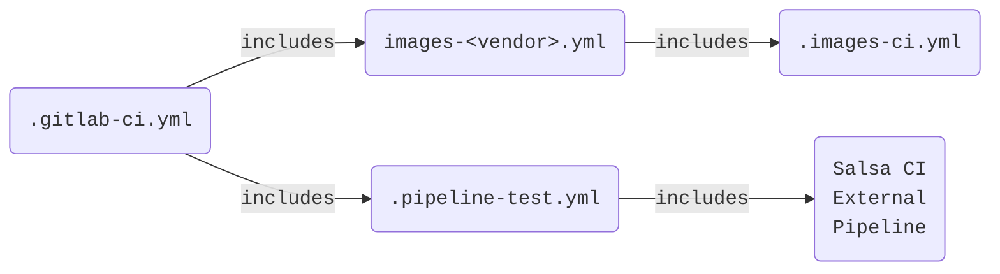

Salsa CI Pipeline Structure
===========================

The Salsa CI pipeline structure is composed mainly by two functional parts: the
external pipeline, that is used by the projects, and the internal pipeline,
that is responsible for making the external pipeline works.



Salsa CI External Pipeline
--------------------------

We call external pipeline to the yaml document included in the users' projects
to make the pipeline to run. This is composed mainly by two files:

* [salsa-ci.yml](salsa-ci.yml): includes the stage and job definitions and the different
  scripts that compose the jobs. It also contains the workflow, rules and
  variables that control the different jobs and their scripts.
* [pipeline-jobs.yml](pipeline-jobs.yml): defines what jobs are actually run, extending the
  definitions found in salsa-ci.yml. In other words, it structures
  the pipeline.

As of April 2024, the Salsa CI pipeline defines three stages: `provisioning`,
`build` and `test`.  The `provisioning` stage aims at preparing any artifact
needed by the build jobs. The current `extract-source` job creates a debianized
source tree that can be used in the next stage to build the debian package. As
its name suggests, the `build` stage comprises the different build jobs. By
default, the pipeline builds for `amd64`, `i386` and the `source` debian
package. Build jobs for other architectures should be added in this stage.
Finally, the `test` stage includes all the automated checks. Most of them
require the artifacts from the amd64 `build` job.

Note: we plan to deprecate the `extract-source` job soon.

Hopefully, the following extracts from the YAML code help to describe how a job
is defined and structured across the files. This is an example taken from the
`build` (amd64) job, aiming to show the modularity of the job definition
structure:

The build job is declared in `pipeline-jobs.yml`, merely extending 
the (hidden) template `.build-package` job:

```yaml
build:
  extends: .build-package
```

The rest of the related code belongs to `salsa-ci.yml`: the `.build-package`
template then extends other two templates, `.build-definition` and
`.artifacts-default-expire`:

```yaml
.build-package: &build-package
  extends:
    - .build-definition
    - .artifacts-default-expire
```

As its name may suggest, the `.build-definition` template is the responsible
for defining the job, it defines the `stage`, the `image` to be used,
the `variables` and so on. The `.build-definition`'s `script` is made partly by
the `build-script` anchor/alias:

```yaml
.build-definition: &build-definition
  stage: build
  image: $SALSA_CI_IMAGES_BASE
  ...
  variables:
    ...
    DB_BUILD_PARAM: ${SALSA_CI_DPKG_BUILDPACKAGE_ARGS}
    DB_BUILD_TYPE: full
  script:
    # pass the RELEASE envvar to any consecutive job
    - echo "RELEASE=${RELEASE}" | tee ${CI_PROJECT_DIR}/salsa.env
    - *build-before-script
    - *build-script
    - mv -v ${CCACHE_TMP_DIR} ${CCACHE_WORK_DIR}
    ...
```

Finally, the `&build-script` anchor is where it can be found the actual code
that builds the package.

Using the same templates we can define another different build job, such as
`build source`. We do so slightly adjusting the job's definition template.
Hopefully this is self-explanatory:

From `pipeline-jobs.yml`:

```yaml
build source:
  extends: .build-source-only
```

From `salsa-ci.yml`:

```yaml
.build-source-only: &build-source-only
  extends:
    - .build-definition
    - .artifacts-default-expire
  cache:
    paths: []  # Override cache for source builds
  variables:
    DB_BUILD_TYPE: source
    SALSA_CI_DISABLE_VERSION_BUMP: 1
```

In the external pipeline we can also find the [recipes](recipes) directory
where vendors can create specific include recipe to easily customize the
pipeline for specific cases.


Salsa CI Internal Pipeline
--------------------------

The Salsa CI internal pipeline has two main goals:
1. create the images used by the different jobs in the external pipeline and
   make them available in the
   [Container Registry](https://salsa.debian.org/salsa-ci-team/pipeline/container_registry)
2. define the Salsa CI's very own CI. The structure of the Internal pipeline
   can be summarised like this:



* [.gitlab-ci.yml](.gitlab-ci.yml): it is the base file that defines the jobs
  for the three different stages of the internal pipeline: `images`, `test` and
  `clean`. The `images` stage relates to the child pipeline that comprises the
  actual image build jobs. See `.images-<vendor>.yml` below.
  The `test` stage is composed of different checks, such as a yaml linter (`yaml
  lint`) or a job that verifies the presence of license statements in files
  (`check license + contributor`), as well as child `test-pipeline`s that
  serve as the internal CI. These latter child test pipeline rely on
  `.pipeline-test.yml` (See below).
* [.images-ci.yml](.images-ci.yml): defines mainly the build image template
  (`.build_template`) and its script in charge of building an image and pushing
  it to the Container Registry. This is the template used (`extended` in the
  GitLab CI terms) in the image build jobs from `.images-<vendor>.yml`.
* .images-<vendor>.yml: configures the different images, their supported
  releases, architectures and any related variables required for building them
  for a specific vendor (e.g. [Debian](.images-debian.yml) or
  [Kali](.images-kali.yml)). The Debian image build jobs includes production or
  staging images, depending if the pipeline is run for the default branch or a
  feature branch, respectively. By default, the `clean images` job from
  `.gitlab-ci.yml` erases the staging images at the pipeline's `clean` stage. 
* [images/](images/): under this directory are found the Containerfiles, scripts
  and patches required to build the different images. As it name suggests,
  [images/containerfiles/base.0](images/containerfiles/base.0), is the base
  Containerfile extended by all the other images.
* [.pipeline-test.yml](.pipeline-test.yml): defines a base to test the external
  pipeline (salsa-ci.yml and pipeline-jobs.yml files) from the same
  repository/branch. It overrides different variables, workflow and environment
  to make it possible to trigger the pipeline for actual projects. The actual
  projects tested are specified in the `.gitlab-ci.yml`'s `test-pipeline` job
  definition.
* [autopkgtest-lxc](https://salsa.debian.org/salsa-ci-team/autopkgtest-lxc):
  This is an additional project whose goal is to create image tarballs used by
  the autopkgtest-lxc jobs. It creates one lxc.tar per supported release, tar
  file that is fetched by the autopkgtest-job according to the target release
  set in the pipeline.


