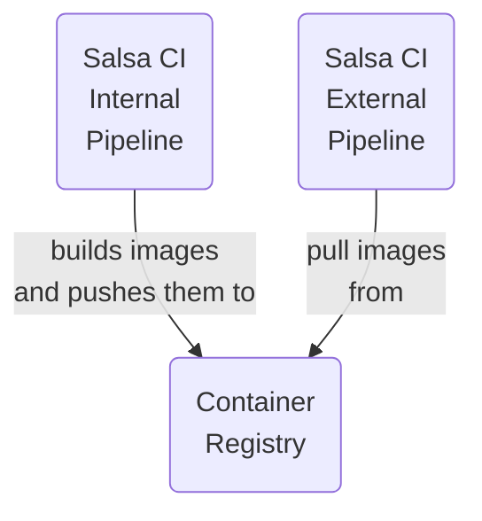
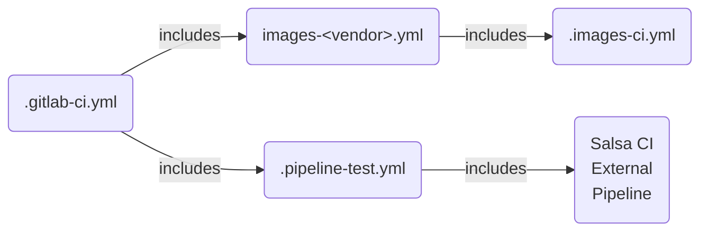

# Salsa CI Pipeline Structure

The Salsa CI pipeline structure is composed mainly of two functional parts: the
external pipeline, which is used by the projects, and the internal pipeline,
which is responsible for making the external pipeline work.


```mermaid
---
config:
  themeVariables:
    fontFamily: monospace
---
flowchart TD;
  SCIP(Salsa CI\nInternal\nPipeline)
  SCEP(Salsa CI\nExternal\nPipeline)
  CR(Container\nRegistry)
  SCIP -- builds images\nand pushes them to --> CR;
  SCEP -- pull images\nfrom --> CR;
```

## Salsa CI External Pipeline

By "external pipeline" we refer to the yaml document included in the users'
projects to make the pipeline to run. This is composed mainly by two files:

* [salsa-ci.yml](salsa-ci.yml): includes the stage and job definitions and the different
  scripts that compose the jobs. It also contains the workflow, rules and
  variables that control the different jobs and their scripts.
* [pipeline-jobs.yml](pipeline-jobs.yml): defines what jobs are actually run, extending the
  definitions found in salsa-ci.yml. In other words, it structures
  the pipeline.

As of January 2026, the Salsa CI pipeline defines four stages: `provisioning`,
`build`, `publish`, and `test`. The `provisioning` stage aims at preparing any artifact
needed by the build jobs. The current `extract-source` job creates a debianized
source tree that can be used in the next stage to build the Debian package. As
its name suggests, the `build` stage comprises the different build jobs. By
default, the pipeline builds for `amd64`, `i386` and the `source` Debian
package. Build jobs for other architectures should be added in this stage.
The `publish` stage handles artifact publication, such as the Aptly repository job.
Finally, the `test` stage includes all the automated checks. Most of them
require the artifacts from the amd64 `build` job.

Note: The `extract-source` job is deprecated and will be removed in a future
release. The pipeline now directly uses the source from the repository.

Hopefully, the following extracts from the YAML code help to describe how a job
is defined and structured across the files. This is an example taken from the
`build` (amd64) job, aiming to show the modularity of the job definition
structure:

The build job is declared in `pipeline-jobs.yml`, merely extending
the (hidden) template `.build-package` job:

```yaml
build:
  extends: .build-package
```

The rest of the related code belongs to `salsa-ci.yml`: the `.build-package`
template then extends other two templates, `.build-definition` and
`.artifacts-default-expire`:

```yaml
.build-package: &build-package
  extends:
    - .build-definition
    - .artifacts-default-expire
```

As its name may suggest, the `.build-definition` template is the responsible
for defining the job, it defines the `stage`, the `image` to be used,
the `variables` and so on. The `.build-definition`'s `script` is made partly by
the `build-script` anchor/alias:

```yaml
.build-definition: &build-definition
  stage: build
  image: $SALSA_CI_IMAGES_BASE
  ...
  variables:
    ...
    DB_BUILD_PARAM: ${SALSA_CI_DPKG_BUILDPACKAGE_ARGS}
    DB_BUILD_TYPE: full
  script:
    # pass the RELEASE_FROM_CHANGELOG envvar to any consecutive job
    - echo "RELEASE_FROM_CHANGELOG=${RELEASE_FROM_CHANGELOG}" | tee ${CI_PROJECT_DIR}/salsa.env
    - *build-before-script
    - *build-script
  after_script:
    - *build-after-script
    ...
```

Finally, the `&build-script` anchor is where it can be found the actual code
that builds the package.

Using the same templates we can define another different build job, such as
`build source`. We do so by slightly adjusting the job's definition template.
Hopefully this is self-explanatory:

From `pipeline-jobs.yml`:

```yaml
build source:
  extends: .build-source-only
```

From `salsa-ci.yml`:

```yaml
.build-source-only: &build-source-only
  extends:
    - .build-definition
    - .artifacts-default-expire
  cache:
    paths: []  # Override cache for source builds
  variables:
    DB_BUILD_TYPE: source
    SALSA_CI_DISABLE_VERSION_BUMP: 1
```

In the external pipeline, we can also find the [recipes](recipes) directory
where vendors can create specific include recipe to easily customize the
pipeline for specific cases. Additionally, the [vars](vars) directory contains
distribution-specific variables and configurations.

## Salsa CI Internal Pipeline

The Salsa CI internal pipeline has two main goals:
1. Create the images used by the different jobs in the external pipeline and
   make them available in the
   [container registry](https://salsa.debian.org/salsa-ci-team/pipeline/container_registry).
2. Define Salsa CI's own CI pipeline. The structure of the internal pipeline
   can be summarised as follows:


```mermaid
---
config:
  themeVariables:
    fontFamily: monospace
---
flowchart LR;
  GLCI(".gitlab-ci.yml");
  IV("images-&lt;vendor&gt;.yml");
  PT(".pipeline-test.yml");
  ICI(".images-ci.yml");
  SCEP("Salsa CI\nExternal\nPipeline");

  GLCI -- includes --> IV;
  GLCI -- includes --> PT;
  IV -- includes --> ICI;
  PT -- includes --> SCEP;
```

* [.gitlab-ci.yml](.gitlab-ci.yml): the base file that defines the jobs
  for the three different stages of the internal pipeline: `images`, `test` and
  `clean`. The `images` stage relates to the child pipeline that comprises the
  actual image build jobs. See `.images-<vendor>.yml` below.
  The `test` stage is composed of different checks, such as a YAML linter (`yaml
  lint`) or a job that verifies the presence of license statements in files
  (`check license + contributor`), as well as child `test-pipeline`s that
  serve as the internal CI. These latter child test pipelines rely on
  `.pipeline-test.yml` (see below).
* [.images-ci.yml](.images-ci.yml): defines mainly the build image template
  (`.build_template`) and its script in charge of building an image and pushing
  it to the container registry. This is the template used (`extends` in
  GitLab CI terms) in the image build jobs from `.images-<vendor>.yml`.
* .images-<vendor>.yml: configures the different images, their supported
  releases, architectures, and any related variables required for building them
  for a specific vendor (e.g. [Debian](.images-debian.yml) or
  [Kali](.images-kali.yml)). The Debian image build jobs include production or
  staging images, depending on whether the pipeline is run for the default branch or a
  feature branch, respectively. By default, the `clean images` job from
  `.gitlab-ci.yml` erases the staging images at the pipeline's `clean` stage.
* [images/](images/): under this directory are found the Containerfiles, scripts
  and patches required to build the different images. As its name suggests,
  [images/containerfiles/base.0](images/containerfiles/base.0), is the base
  Containerfile extended by all the other images.
* [.pipeline-test.yml](.pipeline-test.yml): defines a base to test the external
  pipeline (salsa-ci.yml and pipeline-jobs.yml files) from the same
  repository/branch. It overrides different variables, workflow and environment
  to make it possible to trigger the pipeline for actual projects. The actual
  projects tested are specified in the `.gitlab-ci.yml`'s `test-pipeline` job
  definition.
* [autopkgtest-lxc](https://salsa.debian.org/salsa-ci-team/autopkgtest-lxc):
  This is an additional project whose goal is to create image tarballs used by
  the autopkgtest-lxc jobs. It creates one lxc.tar per supported release, tar
  file that is fetched by the autopkgtest-job according to the target release
  set in the pipeline.

## Performance optimization

### Build cache

Build caching is **disabled by default**. To opt in, set the variable
`SALSA_CI_BUILD_CACHE` to `1`, `yes`, or `true`.

When enabled, the `.build-definition-common` template defines a GitLab CI cache
that is shared across all compilation jobs. The cache key is derived from the
build architecture (`build-${BUILD_ARCH}_${HOST_ARCH}`), so caches for `amd64`,
`i386`, `arm64`, etc. are kept separate.

The cache is only populated by the build job (even partial and failed ones). The
latter jobs have access to the cache to run faster, but they don't upload new
versions of it.

| Job(s) | Cache behaviour when enabled |
|---|---|
| `build`, `build i386`, `build arm64`, `build armel`, `build armhf`, `build ppc64el`, `build riscv64` | Download **and** upload (cache key `build-${BUILD_ARCH}_${HOST_ARCH}`) |
| `build faketime`, `build faketime i386` | Download only (`policy: pull`) |
| `test-build-any`, `test-build-all`, `test-build-profiles`, `test-build-validate-cleanup`, `test-crossbuild-arm64` | Download only (`policy: pull`) |
| `build source` | Disabled (`paths: []`) |
| `autopkgtest`, `lintian`, `piuparts`, `reprotest`, etc. | No cache (do not extend `.build-definition-common`) |

The cache directory (`CACHE_DIR`, default `salsa-ci-cache/`) stores two
subdirectories, `ccache/` and `sccache/`. Additional caches can easily be placed
in the same directory.

Note that while these tools are installed into the build image, it only serves
the purpose of showing statistics. For the actual caching to take place, the
tools are also injected into the sbuild chroot. The sbuild chroot itself is
built on-the-fly on every build job and not cached. The cache directory is
bind-mounted into the sbuild chroot and persists across builds.

### Build environment paths

The pipeline uses several path variables that have different values inside and
outside the sbuild chroot. Understanding this mapping is essential when
debugging build scripts or cache configuration.

| Variable | Outside sbuild (host) | Inside sbuild chroot | Example |
|---|---|---|---|
| `CI_PROJECT_DIR` | `/builds/<user>/<project>` | N/A (not set) | `/builds/debian/grep` |
| `BUILD_DIR` | `${CI_PROJECT_DIR}/salsa-ci-build` | N/A | `/builds/debian/grep/salsa-ci-build` |
| `WORKING_DIR` | `${CI_PROJECT_DIR}/debian/output` | N/A | `/builds/debian/grep/debian/output` |
| `CACHE_DIR` | `${CI_PROJECT_DIR}/salsa-ci-cache` | `/build/cache` | `/builds/debian/grep/salsa-ci-cache` |
| `SBUILD_PKGBUILD_DIR` | N/A | `/build/package` | `/build/package` |

The sbuild chroot is created on-the-fly by `mmdebstrap` and runs with
`$chroot_mode = 'unshare'`. The host `CACHE_DIR` is bind-mounted into the
chroot at `/build/cache` via `$unshare_bind_mounts` in sbuild's config. The
package source is extracted to `${BUILD_DIR}` on the host, and sbuild's
`$dsc_dir` and `$build_path` settings ensure the build happens inside the
chroot under `/build/package`.

### Environment variable propagation

Environment variables flow through three layers, each of which may filter or
sanitize them:

1. **GitLab CI container**: Variables defined in `variables:` or passed by the
   runner are available to the job script.
2. **sbuild**: The `.build-script-setup-environment` anchor writes
   `~salsa-ci/.config/sbuild/config.pl`. Only variables explicitly listed in
   `$build_environment` are passed into the sbuild chroot. sbuild also applies
   `$environment_filter` (by default derived from
   `Dpkg::BuildInfo::get_build_env_allowed()`).
3. **dpkg-buildpackage**: When `debian/rules` is invoked,
   `dpkg-buildpackage` sanitizes the environment aggressively. It only
   preserves variables that Debian considers build-relevant (again via
   `Dpkg::BuildInfo::get_build_env_allowed()`). Variables like
   `RUSTC_WRAPPER`, `CCACHE_DIR`, or `SCCACHE_DIR` are **not** in this
   allowlist and are stripped.

Because of this sanitization, the pipeline avoids relying on environment
variables for tool configuration inside the build:

* **ccache** is configured via `/etc/ccache.conf` inside the chroot (written
  during `mmdebstrap` via `--customize-hook`), which hardcodes
  `cache_dir = /build/cache/ccache`.
* **sccache** is invoked through a `rustc` wrapper placed in
  `/build/cache/wrappers`, which is prepended to `PATH`. The wrapper exports
  `SCCACHE_DIR` locally before calling `sccache`, bypassing the need for the
  variable to survive `dpkg-buildpackage` sanitization.

This three-layer model means that even if a variable is set in the GitLab CI
job and in sbuild's `$build_environment`, it may still be invisible to `cargo` or
`make` inside `debian/rules` unless it is in Debian's build-env allowlist or
injected via a wrapper script.
